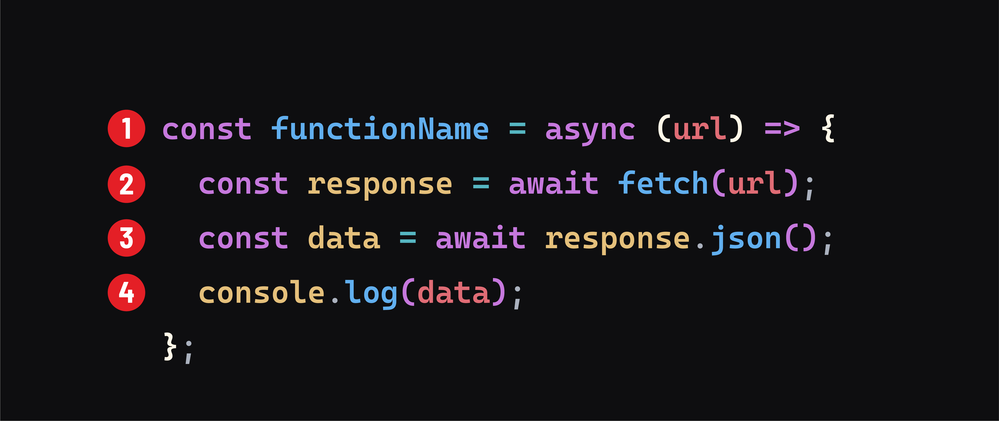

<h1>
  <span class="headline">Intro to Asynchronous Programming</span>
  <span class="subhead">Intro to the <code>Fetch</code> API</span>
</h1>

**Learning objective:** By the end of this lesson, students will understand the basics of the Fetch API in JavaScript and how to make fetch requests.

## What is the Fetch API?

We have two methods of generating HTTP requests in HTML: navigating using links and submitting forms.

JavaScript allows us to make HTTP requests from our application without relying on these two mechanisms. Using the [Fetch API](https://developer.mozilla.org/en-US/docs/Web/API/Fetch_API), any action in JavaScript can make HTTP requests.

The Fetch API facilitates communication between a client and a server, allowing the application (acting as a client) to generate requests and process responses. The primary function provided by the API is the [`fetch()`](https://developer.mozilla.org/en-US/docs/Web/API/fetch) method.

## Anatomy of the `fetch()` method

The `fetch()` method takes two parameters:


1. A URL to the resource you want (the [MDN docs](https://developer.mozilla.org/en-US/docs/Web/API/fetch#parameters) refer to this as the `resource`, but this will always be a URL for our purposes.)
2. An optional options object. The [MDN docs](https://developer.mozilla.org/en-US/docs/Web/API/fetch#options) have documentation for all of the valid properties in this object. The most common ones are covered in more detail below.

Let's take a look at how a basic fetch request is typically constructed:



1. We define an asynchronous function called `functionName` that will accept a URL as an argument. Like any other function, the name we select does not impact how it behaves, but the name should describe what action the function carries out for readability.
2. We use `fetch()` to make a `GET` request to the specified URL inside the function. Since `fetch` is asynchronous, we must use `await` to pause the execution of this function until we receive a response. This is necessary because we can't process data we don't have yet.
3. Next, the response is converted into a JavaScript object using the *[`json()`](https://developer.mozilla.org/en-US/docs/Web/API/Response/json) method*. This step is also asynchronous, so we again use the `await` operator.
4. Finally, the fetched data is logged to the console.

> 📚 The `json()` method converts the *JSON* text in the `body` of a response object to a JavaScript object. It's typically applied to the response object returned by the a `fetch()` to handle *JSON* data sent from a server.
>
> *JSON*, short for JavaScript Object Notation, is a common format for storing and transporting data across the internet. It's structure closely resembles a JavaScript object.

## The `options` object

The [`options` object](https://developer.mozilla.org/en-US/docs/Web/API/fetch#options) allows you to apply various settings to a request made with the fetch method. Some of the most common properties for the options object include:

### [`method`](https://developer.mozilla.org/en-US/docs/Web/API/fetch#method)

The `method` property is used to specify the request's HTTP method (`GET`, `POST`, `PUT`, `DELETE`, etc.). If no HTTP method is provided, the default `GET` method is used.

### [`headers`](https://developer.mozilla.org/en-US/docs/Web/API/fetch#headers)

The `headers` property is used to set HTTP headers for the request. HTTP headers include additional information about the request, such as the type of data being submitted.

### [`body`](https://developer.mozilla.org/en-US/docs/Web/API/fetch#body)

The `body` property includes any data, such as information entered into a form. Here's an example that utilizes the `method`, `headers`, and `body` property.

```javascript
fetch(url, { 
  method: 'POST',
  headers: { 'Content-Type': 'application/json' },
  body: JSON.stringify({ greeting: 'Hello World!' })
});
```

> 💡 In the example above, the [`JSON.stringify()`](https://developer.mozilla.org/en-US/docs/Web/JavaScript/Reference/Global_Objects/JSON/stringify) method converts the JavaScript object into a `JSON` string. Whenever we put `JSON` into the request's `body`, we must also set the `headers` property as demonstrated above: `headers: { 'Content-Type': 'application/json' }`.

## Making a fetch request

Let's make a fetch request using an API called [JSONPlaceholder](https://jsonplaceholder.typicode.com/), which is used for testing and prototyping.

They provide six resources we can get data for - we'll use the `users` resource, which will give us an array of 10 random placeholder user objects.

First, let's define the API *endpoint* we will be using:

```javascript
const usersApiUrl = 'https://jsonplaceholder.typicode.com/users/';
```

> 📚 In the context of an API call, an *endpoint* refers to a specific URL where you can access or interact with a resource. In this case, we're accessing data at this endpoint.

In the next step, we'll create a function to make a `GET` request to this endpoint to access the `users` resource.

## Defining a fetch function

Add the following code to `app.js`:

```javascript
const getAllUsers = async (url) => {
  try {
    const response = await fetch(url);
    const data = await response.json();
    console.log(data);
  } catch (error) {
    console.log(error);
  }
};

getAllUsers(usersApiUrl);
```

Let's break down this code:

In this example, we are defining an `async` function called `getAllUsers`. The function accepts a URL as an argument.

First, note our `try...catch` block. We're telling our app to attempt the fetch request, and if anything goes wrong along the way, catch the error and `console.log()` it.

Inside the `try` block, `fetch()` is called, and the `url` parameter is passed to it. We wait for a response and then turn the JSON on the response's `body` into usable data. We then console log this `data`.

When we run our code, our console should display something like the array below:

```javascript
[
  {
    id: 1,
    name: 'Leanne Graham',
    username: 'Bret',
    email: 'Sincere@april.biz',
    address: {
      street: 'Kulas Light',
      suite: 'Apt. 556',
      city: 'Gwenborough',
      zipcode: '92998-3874',
      geo: [Object]
    },
    phone: '1-770-736-8031 x56442',
    website: 'hildegard.org',
    company: {
      name: 'Romaguera-Crona',
      catchPhrase: 'Multi-layered client-server neural-net',
      bs: 'harness real-time e-markets'
    }
  },
  // more data
]
```
