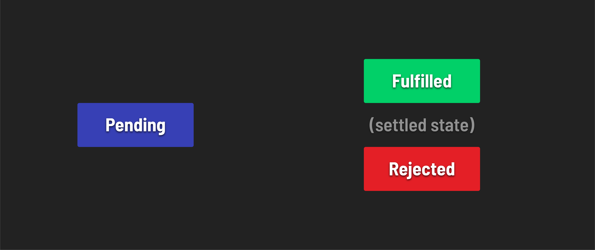

<h1>
  <span class="headline">Intro to Asynchronous Programming</span>
  <span class="subhead">Promises</span>
</h1>

**Learning objective:** By the end of this lesson, students will have a basic understanding of JavaScript promises and their application in managing asynchronous operations.

## Understanding JavaScript promises

[Promises](https://developer.mozilla.org/en-US/docs/Web/JavaScript/Reference/Global_Objects/Promise) in JavaScript are a crucial mechanism that allow us to write asynchronous code. A `Promise` represents the current state of an asynchronous operation.

### Promise states



A promise can exist in one of three states:

1. **Pending**: The initial state of a promise when it's created. The asynchronous operation has not been completed yet, and the results are pending.
2. **Fulfilled**: The asynchronous operation was successful.
3. **Rejected**: The asynchronous operation failed or encountered an error.

Once a promise is either fulfilled or rejected, it is considered ***settled***, and its state can no longer change.

## Handling Promises

In modern JavaScript, many built-in methods return promises, making it easier to work with asynchronous operations.

An example is Node's `fs/promises` module, which contains the `readFile()` method we utilized throughout this lecture.

Promises in JavaScript can be *consumed* in various ways including:

- Using `.then()` and `.catch()` for chaining asynchronous operations.
- `async`/`await` for more modern, readable, and synchronous-style code.
- `Promise.all()` for executing multiple promises concurrently and handling their results together.

> 📚 *Consuming a promise* in JavaScript refers to the process of handling the eventual result (either fulfillment or rejection) of a promise.

## Creating a Promise from scratch

Promises are created using the `Promise` constructor, which takes a function as its argument. This function generally performs an asynchronous operation and calls either `resolve` (on successful completion) or `reject` (on failure).

```javascript
const myPromise = new Promise((resolve, reject) => {
  // Asynchronous operation
  if (/* operation successful */) {
    resolve('Success!');
  } else {
    reject('Failure.');
  }
});
```
